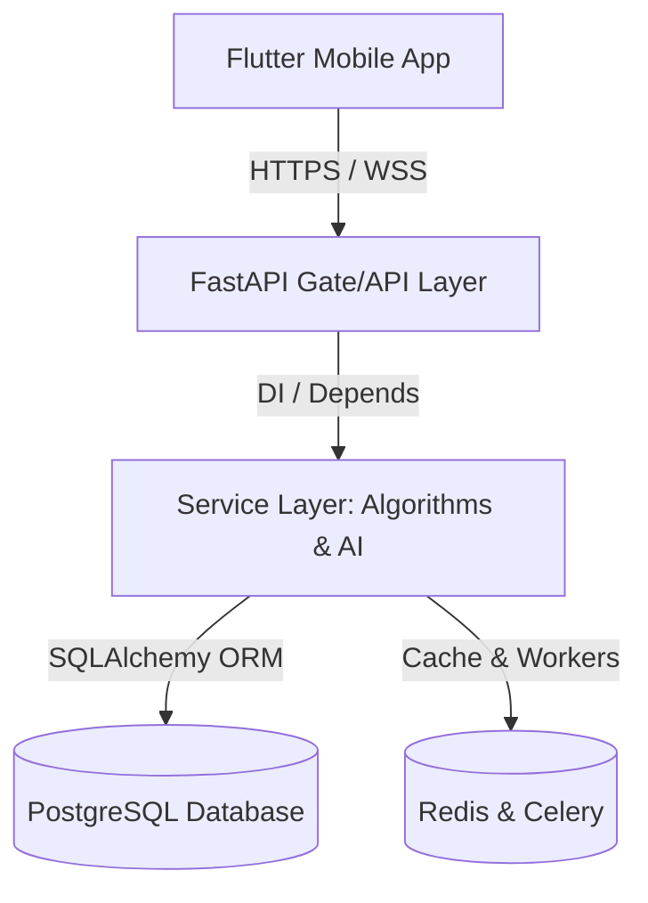

# Cohabio System Architecture Blueprint

This document details the architectural decisions, folder structures, and data flows designed for the Cohabio MVP relocate platform.

## Layered Overview

---

## 📱 Mobile Architecture (Flutter)

Cohabio follows a **Feature-First** layout structure to ensure scalability, meaning every module (auth, profile, roommate matching, communities, chat) is independent.

### Layers within each Feature:
1. **Presentation**: UI widgets, state providers (`StateNotifierProvider`), and view-models.
2. **Domain (optional)**: Models and business rule declarations.
3. **Data**: Api clients, repositories, and local key-value storage handlers.

### Key Technologies:
- **Riverpod**: State management, dependency injection, and caching network calls.
- **Dio**: HTTP Client implementing request interceptors to inject authorization headers, auto-retry queries, and execute token refreshes.
- **Flutter Secure Storage**: Encrypted key-value persistence for access/refresh tokens.

---

## ⚙️ Backend Architecture (FastAPI)

The FastAPI server uses a modular structure mapping schemas and models to API routers.

### Core Structure:
- **`app/core/`**: Configuration settings (`pydantic-settings`), token signing operations, and CORS policy declarations.
- **`app/db/`**: Connection engine initialization, ORM session declarations (`session.py`), and auto-creation steps.
- **`app/models/`**: SQLAlchemy declarative models matching database schemas.
- **`app/schemas/`**: Pydantic models for validation and serialization.
- **`app/services/`**: Independent helper systems (Gemini AI assistants, roommate matching calculations).
- **`app/api/`**: Endpoint routing definitions categorized by entity.

---

## 🤝 Roommate Compatibility Score Algorithm

Match scores are computed deterministically using 6 parameters:
1. **Budget Overlap (25%)**: Measures intersection range between user budgets.
2. **Cleanliness (20%)**: Checks cleanliness alignment (1-5 rating range).
3. **Lifestyle & Sleep (20%)**: Sleep & work routine alignments.
4. **Habits (15%)**: Checks smoking, drinking, and pet tolerances.
5. **Food Preferences (10%)**: Veg, vegan, non-veg compatibility.
6. **Interests (10%)**: Jaccard similarity index on overlapping interest arrays.
