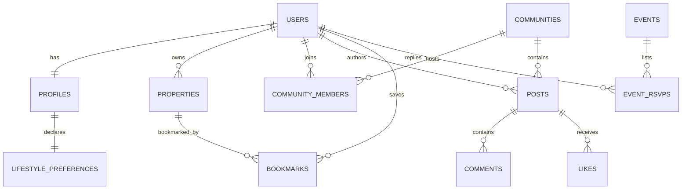

# Cohabio Database Schema & Optimizations

Cohabio runs a fully normalized PostgreSQL database.

## Schema ER Diagram Overview

---

## 🗄️ Table Details

### 1. `users`
Core authentication and role authorization map.
- `id` (UUID, Primary Key)
- `email` (VARCHAR(255), Unique, Indexed)
- `hashed_password` (VARCHAR(255), Nullable for OAuth)
- `phone` (VARCHAR(50))
- `role` (VARCHAR(50)) - `user`, `owner`, `moderator`, `admin`
- `is_verified` (BOOLEAN)

### 2. `profiles`
Detailed demographic details.
- `id` (UUID, Primary Key)
- `user_id` (UUID, Foreign Key to `users.id`, Unique)
- `full_name` (VARCHAR(100))
- `budget_max` (NUMERIC(10,2))
- `current_city` (VARCHAR(100), Indexed)

### 3. `lifestyle_preferences`
Key parameters analyzed by the roommate matchmaking engine.
- `profile_id` (UUID, Primary Key, Foreign Key to `profiles.id`)
- `cleanliness_rating` (INT, CHECK 1-5)
- `sleep_schedule` (VARCHAR(50))
- `interests` (VARCHAR(100)[] Array)

### 4. `properties`
Housing listings metadata.
- `id` (UUID, Primary Key)
- `owner_id` (UUID, Foreign Key to `users.id`)
- `price_per_month` (NUMERIC(10,2))
- `location_lat` / `location_lng` (DOUBLE PRECISION)

---

## ⚡ Indexing & Optimization
- **`idx_profiles_current_city`**: Speeds up location-based student searches.
- **`idx_properties_city` / `idx_properties_price`**: Accelerates marketplace browsing queries.
- **`idx_messages_room_id` / `idx_messages_created_at`**: Optimizes chat feed retrieval.
